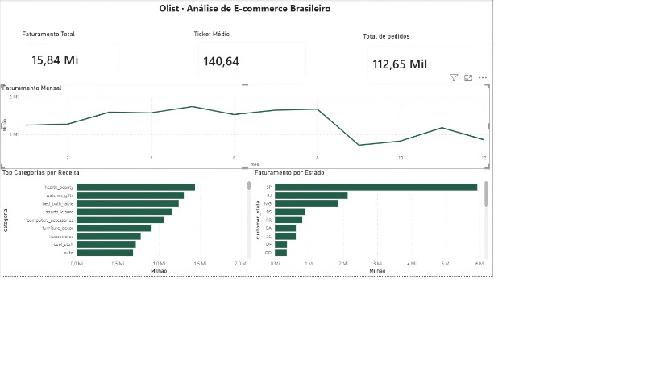

## 📊 Dashboard Power BI

- 📈 Faturamento total por mês
- 🏆 Top 10 categorias por receita
- 🗺️ Faturamento por estado
- 🔢 KPIs: total de pedidos · faturamento total · ticket médio



**Destaques dos dados:**
- **112.650** pedidos processados
- **R$ 15,84 milhões** em faturamento
- **R$ 140,64** ticket médio
- **SP** lidera com ~38% do faturamento nacional

# 🛒 Olist Pipeline — Pipeline Analítico End-to-End


Pipeline de dados **end-to-end** com arquitetura Medallion sobre 100k pedidos reais do e-commerce brasileiro Olist.

---

## 🏗️ Arquitetura
```
┌─────────────┐     ┌──────────────────────────────────────────┐     ┌─────────────┐
│  CSVs Olist │────▶│              MinIO (S3-local)             │────▶│   Power BI  │
└─────────────┘     │  ┌──────────┐  ┌────────┐  ┌─────────┐  │     └─────────────┘
                    │  │  Bronze  │─▶│ Silver │─▶│  Gold   │  │
                    │  │  raw CSV │  │Parquet │  │ DuckDB  │  │
                    │  └──────────┘  └────────┘  └─────────┘  │
                    └──────────────────────────────────────────┘
                                  Apache Airflow
```

> Simula arquitetura AWS: **MinIO ≡ S3** · **DuckDB ≡ Redshift** · **Airflow ≡ MWAA**

---

## 🛠️ Stack

| Ferramenta | Versão | Função |
|---|---|---|
| Apache Airflow | 2.9.1 | Orquestração de pipelines |
| MinIO | latest | Data lake local (API S3-compatible) |
| Python / Pandas | 3.12 | Transformação de dados |
| DuckDB | 1.4 | Banco analítico (equivalente ao Redshift) |
| PyArrow | latest | Serialização Parquet |
| Power BI | Desktop | Visualização e dashboards |
| Docker Compose | v2 | Infraestrutura local containerizada |

---

## 📐 Arquitetura Medallion

| Camada | Formato | Descrição |
|---|---|---|
| 🥉 **Bronze** | CSV | Ingestão raw sem transformação — dados exatamente como vieram |
| 🥈 **Silver** | Parquet | Limpeza, tipagem, remoção de nulos críticos e conversão de datas |
| 🥇 **Gold** | DuckDB | Star schema modelado para consumo analítico |

---

## 🗂️ Modelo de Dados (Star Schema)
```
                    ┌─────────────┐
                    │ dim_cliente │
                    └──────┬──────┘
                           │
┌─────────────┐    ┌───────┴───────┐    ┌─────────────┐
│ dim_produto │────│  fct_pedidos  │────│ dim_vendedor│
└─────────────┘    └───────┬───────┘    └─────────────┘
                           │
                    ┌──────┴──────┐
                    │  dim_tempo  │
                    └─────────────┘
```

**fct_pedidos** — order_id, customer_id, product_id, seller_id, data_pedido, status, valor_produto, valor_frete, valor_total_item, tipo_pagamento, parcelas, valor_pago

---

## 📊 Dashboard Power BI

- 📈 Faturamento total por mês
- 🏆 Top 10 categorias por receita
- 🗺️ Faturamento por estado
- 🔢 KPIs: total de pedidos · faturamento total · ticket médio

**Destaques dos dados:**
- **112.650** pedidos processados
- **R$ 15,84 milhões** em faturamento
- **R$ 140,64** ticket médio
- **SP** lidera com ~38% do faturamento nacional

---

## 🚀 Como executar

**Pré-requisitos:** Docker Desktop instalado

**1. Clone o repositório:**
```bash
git clone https://github.com/lucv555/olist-pipeline.git
cd olist-pipeline
```

**2. Baixe o dataset:**
- Acesse: https://www.kaggle.com/datasets/olistbr/brazilian-ecommerce
- Extraia os CSVs dentro da pasta `data/`

**3. Suba o ambiente:**
```bash
docker compose up airflow-init
docker compose up -d
```

**4. Acesse o Airflow:**
- URL: http://localhost:8080
- Login: `admin` / `admin`

**5. Execute as DAGs na ordem:**
```
dag_ingest_bronze   →   dag_transform_silver   →   dag_load_gold
```

**6. Exporte o Gold para Power BI:**
```bash
python exportar_gold.py
```

**7. Abra o dashboard:**
- Conecte o Power BI nos arquivos em `data/gold_export/*.parquet`

---

## ⚙️ Serviços

| Serviço | URL | Credenciais |
|---|---|---|
| Airflow | http://localhost:8080 | admin / admin |
| MinIO Console | http://localhost:9001 | minioadmin / minioadmin |

---

## 🧩 Desafios e Soluções

### 1. Permissão negada ao instalar pacotes no Airflow
**Problema:** `pip install --user root` instalava no usuário errado, causando `ModuleNotFoundError` nas DAGs.  
**Solução:** Uso da variável `_PIP_ADDITIONAL_REQUIREMENTS` no `docker-compose.yml`, instalando pacotes automaticamente no usuário correto durante a inicialização.

### 2. DuckDB bloqueando conexões paralelas do Power BI
**Problema:** O Power BI abre múltiplas conexões ODBC simultâneas — o DuckDB só permite uma por vez, causando `File is already open`.  
**Solução:** Exportação das tabelas Gold para Parquet via script Python, eliminando a dependência de conexão ativa.

### 3. Airflow iniciando antes do Postgres estar pronto
**Problema:** Container do Airflow tentava conectar ao banco antes do Postgres aceitar conexões.  
**Solução:** `healthcheck` no Postgres com `start_period: 30s` e `retries: 10`, garantindo que o Airflow só sobe após o banco estar saudável.

### 4. Comando `db init` depreciado no Airflow 2.9
**Problema:** `airflow db init` foi depreciado na versão 2.9, causando erro na inicialização.  
**Solução:** Substituição por `airflow db migrate`, comando atual recomendado pela documentação oficial.

---

## 📁 Estrutura do Projeto
```
olist-pipeline/
├── dags/
│   ├── dag_ingest_bronze.py      # Ingestão CSV → MinIO
│   ├── dag_transform_silver.py   # Limpeza CSV → Parquet
│   └── dag_load_gold.py          # Star schema → DuckDB
├── data/                         # CSVs do Olist (não versionados)
├── exportar_gold.py              # Exporta DuckDB → Parquet para Power BI
├── docker-compose.yml
└── README.md
```

---

## 📦 Dataset

[Olist Brazilian E-commerce Public Dataset](https://www.kaggle.com/datasets/olistbr/brazilian-ecommerce)  
100k pedidos reais anonimizados · Brasil · 2016–2018
